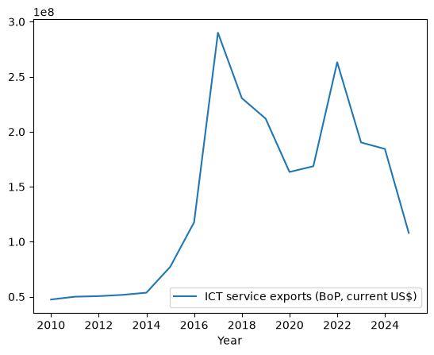
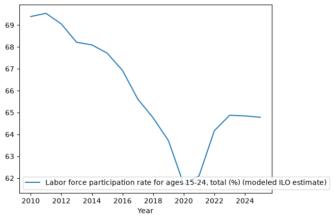
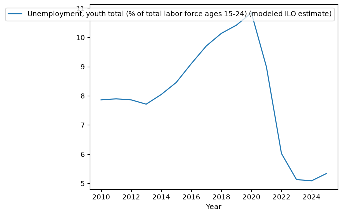
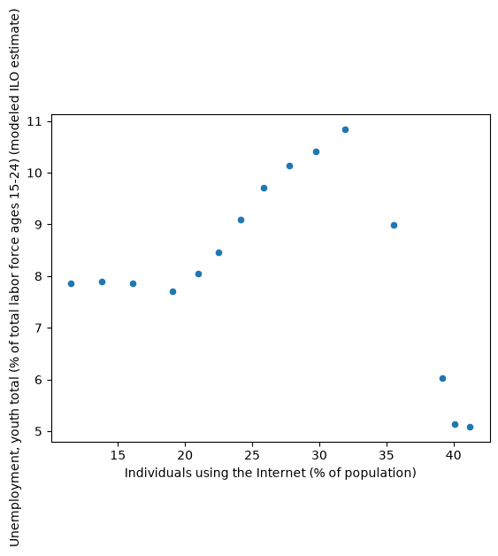

# Are Young Nigerians Prepared for the Future of Work?

## Overview

This project examines the relationship between digital access, human capital and youth labour-market outcomes in Nigeria.

It investigates whether the expansion of Internet use in Nigeria has been accompanied by changes in youth labour-force participation and youth unemployment. The analysis also considers youth literacy and ICT service exports to provide broader context on Nigeria's digital economy.

The project uses annual Nigerian data from 2010–2025 and applies descriptive statistics, trend analysis, correlation analysis and regression techniques to explore these relationships.

The findings are interpreted as associations rather than causal effects.
## Research Questions

This project addresses five main questions:

1. How has Internet access and use in Nigeria changed over time?
2. How have youth human-capital indicators changed alongside digitalisation?
3. How have youth unemployment and labour-force participation changed over the same period?
4. Is there an observable relationship between digital access, human capital and youth labour-market outcomes?
5. What do the findings suggest about preparing Nigerian youth for participation in the digital economy?
## Data

The analysis uses annual data for Nigeria covering 2010–2025, with some indicators having fewer available observations because of gaps in the underlying data.

### Indicators

| Indicator                        | Description                                              | Source                  |
| -------------------------------- | -------------------------------------------------------- | ----------------------- |
| Internet use                     | Individuals using the Internet (% of population)         | World Bank / ITU        |
| Youth literacy                   | Literacy rate among people aged 15–24 (%)                | World Bank / UNESCO UIS |
| Youth unemployment               | Unemployment among the youth labour force aged 15–24 (%) | World Bank / ILOEST     |
| Youth labour-force participation | Labour-force participation among people aged 15–24 (%)   | World Bank / ILOEST     |
| ICT service exports              | ICT service exports (BoP, current US$)                   | World Bank / IMF        |

The data were collected, inspected and cleaned before analysis. Missing observations were retained as missing rather than replaced with assumed values.

The analysis therefore uses available observations for each comparison rather than forcing all indicators into the same time period.
## Methodology

The analysis followed a structured exploratory data-analysis approach:

1. **Data preparation** — Data were collected from World Bank indicators and cleaned in Google Sheets and Python.
2. **Descriptive analysis** — Minimum, maximum, mean, median and first-to-last changes were examined.
3. **Trend analysis** — Annual trends were explored using visualisations.
4. **Correlation analysis** — Pearson correlation was used to examine how indicators moved together.
5. **Year-to-year analysis** — Changes between consecutive years were examined to reduce reliance on relationships driven only by long-term trends.
6. **Regression analysis** — Ordinary least squares (OLS) models were used to explore the relationship between Internet use and youth unemployment, including ICT service exports as an additional predictor.
7. **Robust inference** — Variance inflation factors (VIF) were examined for multicollinearity, while the Breusch-Godfrey test was used to assess autocorrelation. HAC robust standard errors were then applied to account for autocorrelation and heteroskedasticity.

Because the dataset contains a small number of annual observations and is observational in nature, the results are interpreted as exploratory associations rather than causal effects.
## Key Findings

* **Internet use expanded substantially.** The proportion of individuals using the Internet increased from 11.5% in 2010 to 41.21% in 2024, an increase of approximately 29.71 percentage points.

* **Youth labour-force participation declined overall.** The participation rate among people aged 15–24 fell from 69.39% in 2010 to 64.78% in 2025, despite periods of recovery.

* **Youth unemployment also declined overall.** The youth unemployment rate fell from 7.86% in 2010 to 5.34% in 2025, although the series experienced substantial fluctuations, including an increase around 2020.

* **ICT service exports increased overall but were volatile.** The indicator recorded substantial year-to-year fluctuations rather than a consistently increasing trend.

* **Internet use and youth unemployment showed a negative association.** The correlation between Internet use and youth unemployment was approximately −0.30 in levels, while the correlation between their year-to-year changes was approximately −0.66.

* **Internet use and youth labour-force participation showed contrasting trends.** Their correlation in levels was strongly negative (approximately −0.83), while the correlation between their annual changes was positive but weaker (approximately +0.34). This difference highlights the importance of accounting for underlying time trends when interpreting relationships in annual data.

* **Regression results provide suggestive evidence rather than causal proof.** The regression model including Internet use and ICT service exports explained approximately 30.6% of the variation in youth unemployment. However, the analysis is based on only 15 usable annual observations and showed evidence of autocorrelation, requiring HAC-robust standard errors.

Overall, the findings suggest that Nigeria's expansion in digital access has not translated straightforwardly into increased youth labour-force participation. The contrasting movements in participation and unemployment indicate that broader factors including education, migration, demographic changes and labour-market conditions—may also influence youth economic participation.

## Visualizations

### Internet Use Trend

### Youth Labour-Force Participation

### Youth Unemployment

### Internet Use and Youth Unemployment

## Policy Implications

The findings suggest that expanding digital access should be accompanied by investments that help young people convert access into economic opportunity.

Potential priorities include:

* Expanding affordable and reliable Internet access.
* Strengthening digital and technical skills development.
* Connecting education and training programmes more closely with labour-market needs.
* Supporting digital entrepreneurship and employment opportunities for young people.
* Improving digital infrastructure and access to productive online services.
* Collecting better and more frequent data on youth digital skills, employment and economic participation.

The evidence suggests that **digital access is an important foundation, but access alone may not be sufficient to improve youth labour-market outcomes.**
## Limitations

Several limitations should be considered when interpreting the findings:

* The analysis is based on a relatively small number of annual observations.
* Data availability varies across indicators, particularly for youth literacy.
* The study uses observational data, so the relationships identified do not establish causality.
* Long-term trends may influence correlations between variables.
* Other factors affecting youth employment and labour-force participation are not included in the models.
* ICT service exports are measured in current US dollars and therefore do not account for inflation.
* The results should be interpreted as exploratory evidence rather than definitive estimates of causal effects.
## Tools

* Python
* Pandas
* Matplotlib
* Statsmodels
* Google Sheets
* Git & GitHub
